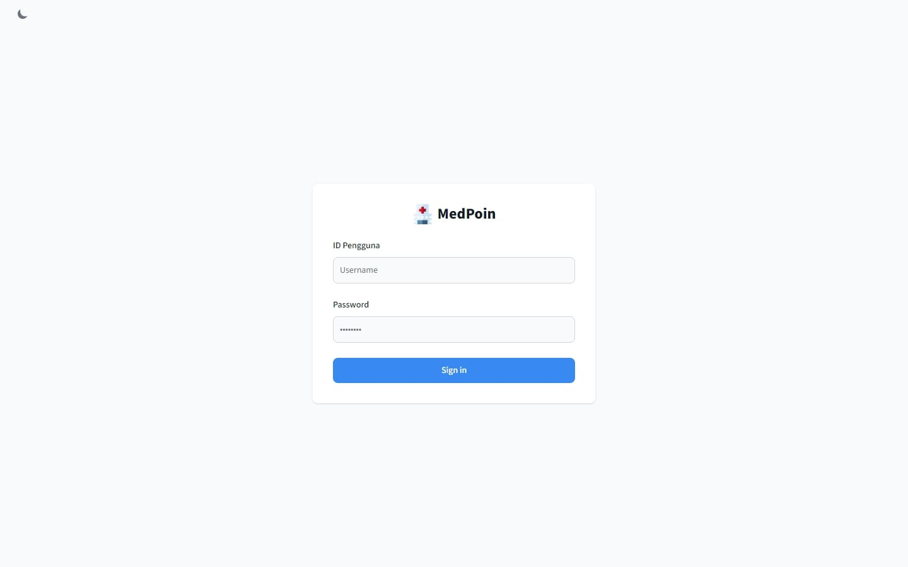
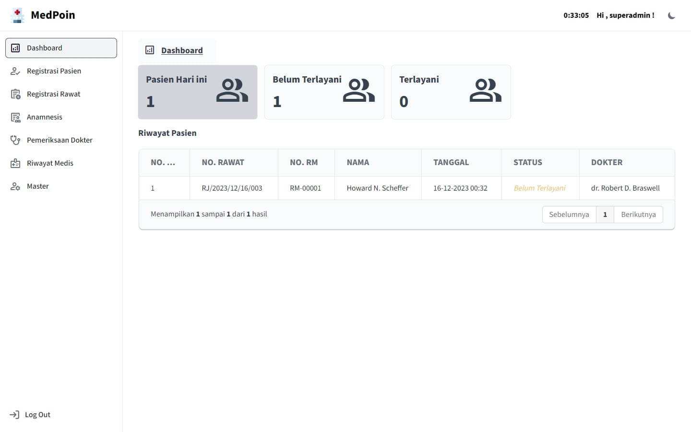
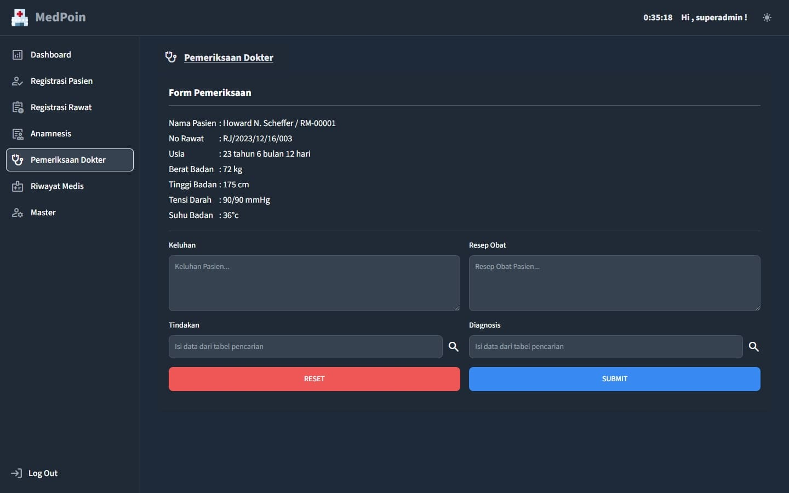
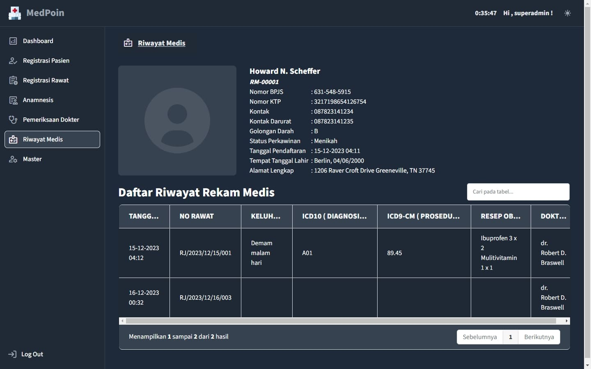
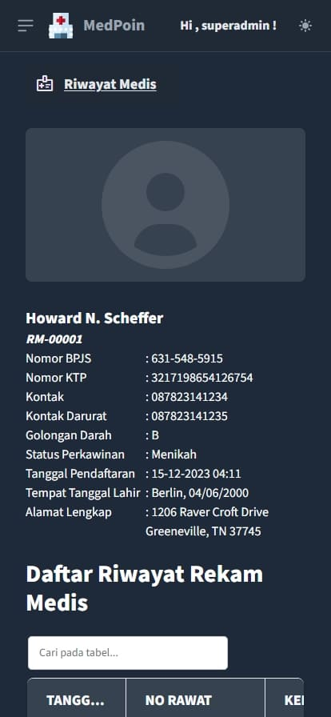
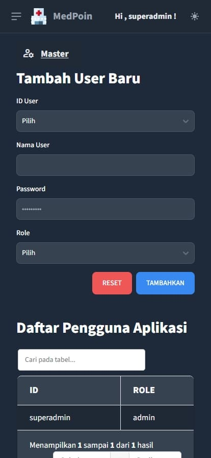

# MedPoin

Medpoin adalah aplikasi web yang dirancang untuk pencatatan rekam medis digital. Aplikasi ini memberikan solusi modern untuk mengelola informasi kesehatan pasien secara efisien, cepat dan paperless


## Screenshots
Login Page  
  
Dashboard  
  
Pemeriksaan  
  
Rekam Medis  
  
Phone  

  

## Fitur

- Light/dark mode
- Responsive
- Otentikasi Login Pengguna
- Pendaftaran Rekam Medis Pasien Baru
- Pendaftaran Perawatan Pasien
- Pemeriksaan Anamnesis Oleh Perawat
- Pemeriksaan Dokter 
    - Keluhan
    - Resep Obat
    - Kodifikasi Tindakan IC9-CM
    - Kodifikasi Diagnosis ICD 10
- Pencarian Rekam Medis
- Manajemen Pegawai dan Pengguna Aplikasi
    - Admin
    - Perawat
    - Dokter
    - Users Aplikasi


## Teknologi yang Digunakan

Berikut adalah beberapa teknologi utama yang digunakan dalam pengembangan Medpoin:

- [Babel](https://babeljs.io/) - Compiler JavaScript modern.
- [Webpack](https://webpack.js.org/) - Bundler untuk proyek JavaScript.
- [Tailwind CSS](https://tailwindcss.com/) - Framework CSS utility-first.
- [Flowbite](https://flowbite.com/) - Komponen UI modern untuk pengembangan web.
- [Grid.js](https://gridjs.io/) - Tabel interaktif JavaScript.
- [JWT Decode](https://www.npmjs.com/package/jwt-decode) - Pustaka untuk mendecode JSON Web Tokens.
- [SweetAlert2](https://sweetalert2.github.io/) - Pustaka untuk tampilan alert yang menarik.
- [Workbox](https://developers.google.com/web/tools/workbox) - Pustaka untuk caching dan manajemen offline pada web.

## Prasyarat

- Node.js
- npm (Node Package Manager)
- Web Browser 
- [Medpoin Backend Server](https://github.com/BAMBAROO/med_poin_backend) 

## Instalasi

1. Clone / download repositori ini ke dalam direktori lokal Anda

```bash
  git clone https://github.com/Mask512/MedPoin.git
```

2. Masuk ke direktori lalu install dependensi

```bash
  cd MedPoin
  npm install
```

3. Konfigurasi file lingkungan (environment) untuk URL API ENDPOINT / [Medpoin Backend Server](https://github.com/BAMBAROO/med_poin_backend) .
  Buat file .env (untuk build) atau .env.development (untuk pengembangan), lalu simpan.  
  Contoh :

```bash
  BASE_URL=http://localhost:5000/
```
4. Jalankan aplikasi  

  Development :
```bash
  npm run start:dev
```
Build :
```bash
  npm run build
```
Jalankan hasil build dengan http-server Node.js (pastikan http-server telah terinstal)

```bash
  npm run build
  npm run serve
```

Buka aplikasi di web browser . default di http://localhost:9100
## Demo

_Kami deploy aplikasi di private server dengan protokol http menyebabkan service worker dan caching tidak berjalan secara default_

[Live Demo](http://medpoin.sytes.net/)

```
 Username : superadmin
 Password : nimdarepus
 ```

## Credits

- [](https://tailwindcss.com)
- [](https://flowbite.com)
- [](https://gridjs.io)
- [](https://sweetalert2.github.io)
- [](https://developer.chrome.com/docs/workbox)
